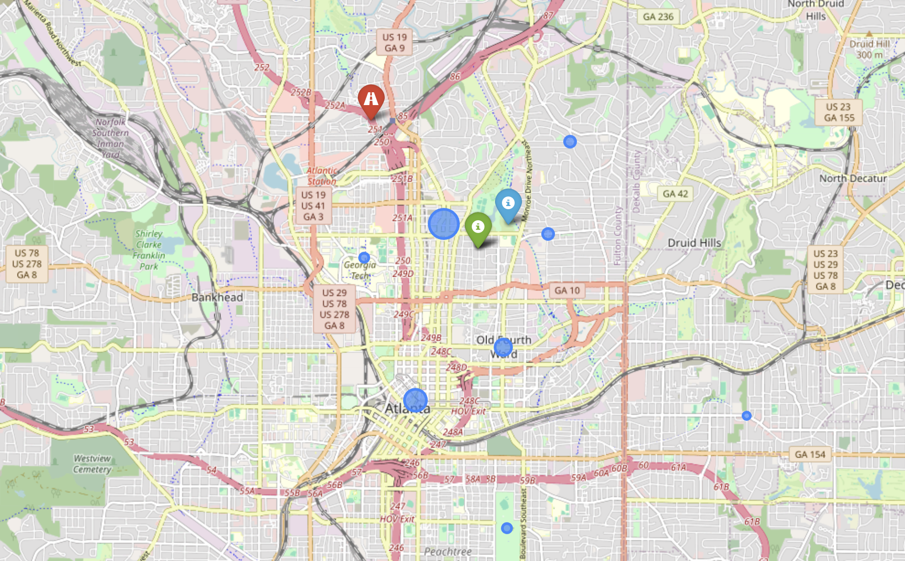

# Atlanta Parcel Pick-up Facility Location Optimization
This project identifies the optimal location for a parcel pick-up facility in Atlanta, Georgia, by analyzing the 10 most populous neighborhoods and comparing theoretical geometric models with real-world driving data.

## 1. Project Overview
The goal of this assignment is to determine the most efficient site for a new facility based on the population distribution of Atlanta's top 10 neighborhoods. We compare two distinct approaches:
* **Method 1: Haversine Distance** (Mathematical midpoint).
* **Method 2: Driving Distance/Time** (Real-world road network optimization).

## 2. Methodology
The analysis was performed using the following steps:
1.  **Data Acquisition**: Scraped neighborhood population data and geographic coordinates for the top 10 most populous areas in Atlanta.
2.  **Haversine Optimization**: Calculated the population-weighted geometric median to find the theoretical center.
3.  **Driving Metrics Optimization**: 
    * Generated a candidate grid of potential locations.
    * Used the **Google Maps Distance Matrix API** to calculate weighted average travel time and road distance for each candidate.
    * Identified the site that minimizes total travel time for all residents.
4.  **Visualization**: Mapped all neighborhoods and the results of both methods using `folium`.

## 3. Insights & Results

### Final Comparison Summary
| Metric | Method 1: Haversine (Midpoint) | Method 2: Driving (Optimal) |
| :--- | :--- | :--- |
| **Optimal Address** | 320 8th St NE, Atlanta, GA 30309 | 1629 Loring Dr NW, Atlanta, GA 30309 |
| **Weighted Avg Time** | 10.12 minutes | **8.99 minutes (Best)** |
| **Weighted Avg Distance** | **4.65 km (Shortest)** | 6.83 km |

### Key Findings
* **Time-Distance Paradox**: The Haversine location minimizes physical distance (4.65 km) but is **12.5% slower** than the Driving-Optimal site. The Driving-Optimal location increases travel distance but reduces time to 8.99 minutes by providing superior access to major arteries (I-75/85), bypassing local congestion.
* **Strategic Implications**: For a parcel facility, **time is the most valuable metric**. Method 2 is superior, saving an average of **1.13 minutes per trip**, which enhances facility throughput and user convenience.
* **Spatial Shift**: The shift from the Midtown core (Haversine) toward the Loring Heights area (Driving) illustrates that in Atlanta, road network efficiency dictates true accessibility more than simple proximity.

### Comparison Map


## 4. Folder Structure
```text
.
├── atl_facility_location.ipynb           # Main Jupyter Notebook with code & analysis
├── atl_facility_location_report.pdf      # PDF report with code & analysis
├── atl_neighborhoods_geocoded.csv        # Raw/processed CSV data
├── map_results                           # Map results
└── README.md                             # Project documentation and insights
